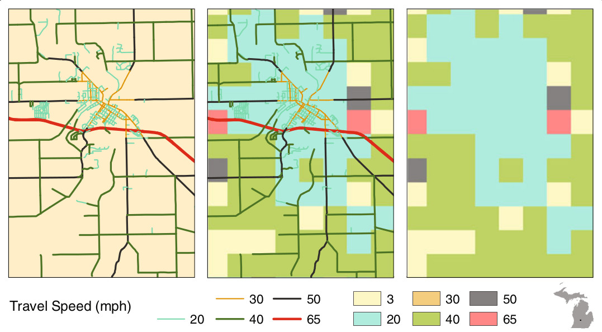

\renewcommand\refname{Referências}


```{r setup, include=FALSE}
knitr::opts_chunk$set(echo = FALSE)

# referência: https://github.com/TWIAV/Spatial_Analysis_in_R_with_Open_Geodata/issues/6
# Set an output hook to split st_read output so it doesn't extend beyond line width
knitr::knit_hooks$set(
  # modify the output
  output = function(x, options){
    
    # Split in lines
    lines <- unlist(strsplit(x, split = "\n"))
    
    #--------------------------------------------------------------------------*
    # modify the lines we expect to bleed out of the margins ----
    #--------------------------------------------------------------------------*
    
    # For the dsn specification
    lines <- gsub(
      pattern = "' ",
      replacement = "'\n## \t",
      x = lines
    )
    lines <- unlist(sapply(lines, strsplit, split = "\n"))
    
    
    # For the dsn file path
    lines <- ifelse(
      test = grepl("from data source ", lines),
      # Adjust so segments are split in /
      yes = gsub(
        pattern = "/([^/]*)\n",
        replacement = "/\n## \t\\1",
        # Split in fixed width segments
        x = gsub(
          pattern = "(.{,65})",
          replacement = "\\1\n",
          x = lines
        )
      ),
      no = lines
    )
    
    
    # For the proj4 string specifications
    lines <- ifelse(
      test = grepl("proj4string:", lines),
      yes = gsub(
        pattern = "[+]",
        replacement = "\n## \t+",
        x = lines
      ),
      no = lines
    )
    
    # bind the lines
    x <- paste(
      "```",
      paste0(lines, collapse = "\n"),
      "```",
      sep = "\n"
    )
    
    return(x)
  }
)


library(tidyverse)
library(sf)
library(kableExtra)
library(tmap)

```


```{r}
servicos <- readRDS("./dados/02_serviços.rds")
viagens <- readRDS('./dados/01_viagens_2.rds')
demog <- readRDS('./dados/03_demografia.rds')
unids <- readRDS('./dados/04_unidadesRFB.rds') %>% 
            mutate(
              ibge_unid = ifelse(
                is.na(ibge_area), 
                ibge_municipio,  
                ibge_area)
              ) %>% 
            distinct()

```


# Introdução

<!-- adensar mais a introdução, explicitar mais o que está se propondo -->

Neste artigo, buscaremos sugerir um processo baseado em dados para definir uma distribuição eficiente das unidades de atendimento presencial da Receita Federal do Brasil. Para isso, iremos realizar uma análise de dados demográficos dos municípios brasileiros, levantado no Censo de 2010, categorizando-os por proximidade em tempo de viagem de carro para a unidade de atendimento mais próxima. Com isso, poderemos descobrir e analisar o público-alvo teórico de cada unidade de atendimento, descrevendo-os estatisticamente e demonstrando como essa análise pode ser utilizada para se definir uma reorganização das unidades atuais.

Na primeira seção, iremos discutir a urgência da aplicação de um método mais analítico e objetivo na distribuição das unidades de atendimento no território nacional, levantando obstáculos para a manutenção do _status quo_. Na segunda seção, explicaremos quais as opções de modelos geográficos para a efetuação da análise e apontaremos as fontes de dados que serão utilizadas. Na última seção, realizaremos a descrição dos públicos-alvo e discutiremos caminhos para expansão, refino e aplicação prática da análise realizada na tomada de decisão da organização. 

# 1. Digitalização, crise e atendimento

<!-- ignorar discussão de recursos escassos, falar de um contexto de restrição de recursos e citar algum manual de gestão pública em vez da wikipedia -->

Os recursos, sabemos, são escassos. Frente às necessidades e desejos, a nobreza do serviço público não subverte tal incômoda realidade. Cabe aos gestores da coisa pública planejar, executar e controlar o que estiver sob sua responsabilidade de forma a conhecer a demanda e maximizar a oferta [@wikipedia_service_2019]. 

Serviços, diz a definição, são intangíveis:  transações que não envolvem a entrega de bens materiais e conquanto, não assumem uma forma. São produzidos e consumidos simultâneamente. Hoje, com o advento da internet e das TIC (tecnologias da informação e da comunicação), é possível oferecer diversos serviços sem que seja necessária a presença do ofertante e do demandante no mesmo local físico. O acesso a essas tecnologias, claro, ainda é limitado.

Este é o caso do atendimento presencial oferecido por diversos órgãos públicos, conjunto no qual está inserida a Secretaria da Receita Federal do Brasil (RFB). Por ele, o cidadão pode tanto entregar quanto requisitar informações, declarações e documentos essenciais à conformidade tributária, auxiliando no papel da instituição de recolher os recursos necessários ao provimento dos diversos serviços públicos oferecidos pelo Estado brasileiro. No papel de orientação, são também instrumentos de educação fiscal e promoção da auto-regularização, fomentando uma cultura de conformidade pro-ativa e cidadã.

O atendimento já foi alvo de extensa digitalização, evidenciado em seus números. A virtualização dos serviços de atendimento da RFB avança a passos largos; entre 2012 e 2017, o e-Cac, portal de atendimento na internet da RFB, passou de 66,6 milhões de atendimentos para 145,6 milhões de atendimentos. Enquanto isso, os atendimentos presenciais caíram de 20,2 milhões para 14,9 milhões no mesmo período, de forma que o percentual destes passou de cerca de 24% do total para apenas 9%. Mesmo assim, 14,9 milhões equivalem a 40.000 cidadãos recebidos nas 522 unidades da RFB por dia, em todo o país [@receita_federal_do_brasil_relatorio_2018].


Desta realidade, surgem os dilemas do gestor. Para suprir essa necessidade de simultaneidade física entre os servidores da RFB e o cidadão demandando serviços, cabe a ele escolher como distribuir geograficamente os recursos materiais e os servidores disponíveis. Eles não tem solução única. Possíveis respostas tem sido levantadas em outros setores de serviço, como de transporte e de saúde, com a aplicação de Sistemas de Informações Geográficas (GIS, na sigla em inglês) e técnicas de geoestatísticas que permitam encontrar soluções numericamente satisfatórias. No exemplo do setor de saúde, por exemplo, o problema é exposto ao se perceber que as unidades de saúde são finitas e estão distribuídas em locais fixos, enquanto a população que elas servem estão distribuídas de forma contínua e desigual numa região [@delamater_measuring_2012, pp. 1] [^1].

[^1]: "health care services are provided at a finite number of fixed locations, yet they serve populations that are continuously and unevenly distributed throughout a region".

<!-- expandir um pouco, sobre o papel redistributivo do Estado -->

Consequência natural desse arranjo é que as desigualdades são inevitáveis, mas a dimensão dessas é função: do arranjo de distribuições das partes do sistemas; da distribuição no espaço da população; e das características do espaço, como infraestrutura e relevo, que dificultem ou facilitem a movimentação [@delamater_measuring_2012].

Ao se analisar a relação entre população e o espaço físico, podemos evidenciar a resistência ao acesso de diferentes grupos populacionais, aos serviços identificar áreas de maior limitação no acesso, e, assim, "compreender o efeito de se abrir, fechar ou realocar unidades de saúde [@delamater_measuring_2012, pp. 2]" [^2]. Desta forma, promove-se a equidade, que "(...) se manifesta na distribuição, acesso e utilização de serviços de saúde entre grupos da população [@noor_defining_2003, p.917]" [^3].

[^2]: "understand the effects of opening, closing, or realocating health care facilities".
[^3]: "(...) manifests itself in the distribution, access to and utilization of health services between population groups".

A relevância da distribuição ótima é tanto mais importante quanto mais escassos forem os recursos disponíveis. O Brasil enfrenta desde meados de 2014 uma grave crise econômica, com efeitos diversos sobre a população e sobre a estrutura administrativa do Estado. Mesmo o órgão arrecadador não escapa das restrições necessárias ao ajuste fiscal aplicado na tentativa de debela-la. Neste sentido, o TCU, em auditoria operacional realizada na RFB, relata que a crise econômica impacta tanto receitas fazendárias e previdenciárias, o que se percebe pela baixa recuperação dos créditos tributários [@uniao_auditoria_2017, pp. 1]. 

Os reflexos internos na Receita Federal do Brasil são o contingenciamento de despesas e a paralisação de concursos, estancando o fluxo de renovação de servidores. Em paralelo, há um processo de aceleração nas aposentadorias, muitas delas influenciadas pelo temor que os anúncios da reforma previdenciária inspiram. 

Vale lembrar que muitos servidores na ativa  já alcançaram o requisito mínimo para aposentar-se mas continuam em serviço, incentivados pelo chamado abono permanência [@uniao_auditoria_2017]. Entre 2015 e 2017, a RFB perdeu 1.831 servidores, de um total inicial de 23.687, o que representa uma diminuição de 7,7% de sua força de trabalho em apenas 3 anos.

Este enxugamento, pode-se argumentar, não seria de todo impactante na organização, posto que, com o avançar da digitalização, haveria um aumento na produtividade que compensaria em parte ou mesmo totalmente os efeitos da diminuição na quantidade de servidores. Todavia, o TCU no lembra no mesmo relatório que fatores exógenos à organização como restrições orçamentárias e disponibilidade do Serpro para desenvolvimento não permitem que a tecnologia avance num passo suficiente para suprir essa demanda crescente necessária [@uniao_auditoria_2017, pp. 20]. 

Desta forma, temos um panorama aproximado do contexto em frente aos gestores da Receita Federal do Brasil. De um lado, há um quantitativo decrescente de servidores disponíveis para as tarefas da organização. De outro, percebemos uma gama de obstáculos que impossibilitam sua substituição imediata por canais digitais. Cabe-os então decidir, como distribuir as unidades da forma mais eficiente? De que maneira promover a equidade no acesso aos serviços da organização? O objetivo do presente trabalho é sugerir um modelo que, incluído num processo maior, possa responda às essas necessidades.

Acreditamos que esse processo de distribuição das unidades de atendimento está no âmago da estratégia da Receita Federal do Brasil e de seu propósito para a sociedade. Como tal, sugerimos que, definidas as balizas estratégicas de qual público alvo deve ser atingido pelas unidades de atendimento, a organização empregue modelos geoestatísticos na tomada de decisões de que unidades abrir e fechar e quantos servidores devem se dedicar em cada unidade, de acordo com a demanda estimada para cada ponto geográfico. Desta forma, a distribuição estaria mais alinhada ao seu objetivo social, tornando-o menos vulnerável a captura política.  

Este trabalho, de forma mais pontual, busca mostrar a viabilidade do cruzamento de dados estatísticos e geoestatístico do IBGE e de outras fontes para conhecer e explorar informações relevantes sobre o público alvo das unidades de atendimento, um dos passos necessários ao processo descrito acima. 

# 2. Das fontes de dados e métodos de extração, análise e cruzamento
## 2.1 Mapas vetoriais e mapas em grade

Há duas formas de se dispor dados em sistemas de informação geográficas. Há os modelos vetoriais, que podem ser analisados como grafos em redes ( _network graphs_ ); e os modelos em grade ( _raster_ ). 

Os modelos vetoriais consistem de uma série de nós, conectados por linhas, representando os objetos geográficos. Pontos no mapa são representados por nós; conexões e infraestruturas como ferrovias e rodovias são linhas, e regiões são delimitadas por polígonos, nós combinados com vértices. Nos modelos vetoriais, o custo para atravessar uma linha é função do tamanho da linha e da velocidade de viagem associado àquele tipo de infraestrutura [@delamater_measuring_2012]. a movimentação, portanto, ocorre entre pontos, de acordo com as linhas disponíveis para cada ponto. 

Os modelos de grade são compostos por uma série de celulas regulares, geralmente retangulares, de tamanho e distância padronizados. Cada ponto do mapa é resumido em um dos retângulos, e todas as informações relevantes do mapa dentro da região encoberta por aquele retângulo são a ele atribuído. No modelo de grade, as viagens ocorrem na passagem de uma célula para outra,  sempre em entre células adjacentes; assim, diferente do modelo em rede, os passos da viagem são sempre regulares em distância, variando apenas na velocidade [@delamater_measuring_2012].





Vemos acima uma conversão entre um mapa em network para um mapa em grid [@delamater_measuring_2012, figure 12]. Há uma diferença fundamental na forma como esses modelos compreendem o espaço.

<!-- conferir se a identação abaixo deu certo -->

\setlength{\parindent}{4cm} 

\linespread{1} "O modelo de dados em grade define o espaço como uma superfície contínua onde cada célula do espaço dos dados tem um local específico e um valor de atributo. O modelo de dados em rede define o espaço como um recipiente vazio populado apenas pelas características de locais e atributos específicos [@delamater_measuring_2012, pp. 12]" [^4]. \end

\setlength{\parindent}{0pt}

[^4]: "The raster data model defines space as a continuous surface where each cell within the data extent has a specific location and attribute value. The network data model defines space as an empty container that is populated only by features having specific locations and attributes." 

Como todas as localizações do mapa são explicitamente definidadas nos modelos de grade, isso torna-os "(...) atraentes para criação de áreas de serviço, especialmente em regiões sem redes de transporte abrangentes [@delamater_measuring_2012 p. 4]" [^5]. Todavia, "conectividade na vida real não é levada em consideração nos modelos de dados em grade (...), portanto, o movimento é menos restringido nos modelos de dados em grade do que no mundo real e as estimativas de tempo de viagem vão ser geralmente subestimadas [@delamater_measuring_2012, pp. 15]". [^6]

[^5]: "(...) attractive for creating service areas, specially in regions without a all-encompassing transportation network"
[^6]: "real-world connectivity is not accounted for in the raster data model (...) therefore, movement is less restricted in the raster data model than in the real world and travel time estimates will generaly be underestimated"

Isso ocorre porque o modelo considera que todos os pontos do mapa são atravessáveis, fazendo, por exemplo, que um viajante pudesse aproveitar-se da infraestrutura ferroviária entrando em qualquer ponto que fosse mais próximo dele, ignorando a existência de estações ou, no caso de rodovias, intersecções [@j._weiss_global_2018].

Para nós, a adoação de um modelo vetorial bastaria para uma primeira aproximação. O modelo em grade enfrentaria as limitações mencionadas acima e seu custo computacional seria consideravelmente mais elevado. Ademais, o modelo em grade serviria apenas para as poucas regiões do país com baixa densidade de infraestrutura.

Inicialmente, havíamos considerado a utilização de informações de infraestrutura do Malaria Atlas Project para estimar o custo de fricção, que foi gerado a partir de informações obtidas do Open Street Map [@j._weiss_global_2018]. Optamos, todavia, pela utilização direta dos dados do Open Street Map, simplificando os municípios para pontos unitários no espaço geográfico.

Algumas presunções devem ser explicitadas antes de qualquer análise. Primeiro, os modelos assumem que todos possuem acesso a veículos similares e que se movimentam nesses veículos de forma similar, o que pode ser pouco realista mesmo considerando-se apenas viagens terrestes. "A riqueza em particular é um determinante provável de se alguém irá viajar à pé em vez de tomar um véiculo e, portanto, afeta substancialmente a acessibilidade no nível do indivíduo [@j._weiss_global_2018, pp. 338]" [^7].

[^7]: "Wealth, in particular, is a likely determinant of whether someone travels on foot rather than taking a vehicle and thus substantially affects acessibility on the level of the individual"

Em segundo lugar, assume-se uniformidade nas condições de viagem, ignorando-se horário, sazonalidades como horário de rush ou fins de semana e feriados, variações temporais e climáticas, etc.  Em terceiro lugar, assume-se que as pessoas conhecem o caminho mais eficiente; uma presunção razoável atualmente, com o amplo acesso à sistemas de navegação em celulares e computadores. Em quarto lugar, presume-se que as populações concentram-se num único ponto; ou seja, qualquer variação da distribuição interna a cada um dos retângulos da grade é ignorada, e atribui-se à centroide de cada retângulo a totalidade da população daquele espaço [@delamater_measuring_2012].

Seria mais realista um modelo que pudessemos combinar as informações demográficas dos grupos populacionais mais próximos, independente de divisões municipais. Todavia, esse tipo de levantamento de dados não seria apenas custoso mas também traria diversos riscos à privacidade da população analisada. Como tal, fazemos o registro apenas para reconher o risco, em nossa análise, de enfrentarmos algumas falácias estatísticas, como a falácia ecológica e o problema da unidade de área modificável. 

## 2.2 Preparação dos dados

Para realizar as analises propostas, uma gama de fontes de dados de natureza e informações diferentes foram levantadas. Primeiramente, foram levantados os serviços disponíveis na Receita Federal, para descobrirmos quais dos serviços oferecidos necessitam do canal presencial das unidades de atendimento [@receita_federal_do_brasil_lista_nodate]. Essas informações foram extraídas diretamente do site da RFB na internet. Outra informação obtida no site da Receita foi a lista atualizada de unidades de atendimento disponíveis, incluindo seus endereços e tipos [@receita_federal_do_brasil_unidades_nodate]. 

Com os dados das unidades de atendimento e dos serviços, uma escolha pode ser realizada. Percebemos que, em geral, há uma divisão muito clara entre serviços de atendimento de natureza aduaneira e serviços de natureza tributária; ademais, para as pessoas físicas, os serviços aduaneiros resumem-se àqueles de verificação de bagagem internacional. Essas descobertas são melhor desenvolvidas na seção 3.1, abaixo. Ademais, quando restringimos as unidades de atendimento àquelas que prestam serviços de natureza tributária, percebemos também que elas, em geral, resumem-se a apenas uma unidade por município, com exceção dos municípios de São Paulo, Rio de Janeiro, Belo Horizonte e Curitiba. Para essas unidades, decidimos ir ao nível de área de ponderação, subdivisão censitária estabelecida pelo IBGE. Por isso, precisávamos da localização de cada unidade de atendimento destes municípios para identificar a qual área de ponderação ela estava contida, usando a API do Google Maps [@google_plataforma_nodate].

As malhas digitais dos municípios foram obtidas no IBGE. As malhas dos municípios puderam ser obtidas sem grandes dificuldades utilizando o pacote GeoBr [@pereira_geobr:_nodate], disponibilizado no GitHub pelo IPEA; as malhas das áreas de ponderação, todavia, não puderam ser obtidas com o mesmo pacote, devido à problemas no código desse; baixamos as malhas dos setores censitários, disponibilizadas em FTP pelo IBGE, e utlizando informação entregue pelo IBGE em consulta de SAI, fizemos o agrupamento dos setores nas áreas de ponderação. 

Para os municípios e áreas de ponderação em análise, obtivemos no IBGE tabelas do censo que nos dessem informações sobre a população economicamente ativa e inativa e sobre a distribuição da popílação por faixa etária, além da distribuição por faixa salarial [@ibge_censo_2011].  

Por fim, utilizamos os dados disponibilizados gratuitamente no OpenStreetMap para fazer medições de tempo e distância de viagem à carro entre municípios e áreas de ponderação [@geofabrik_openstreetmap_nodate]. 

# 3. Dos resultados
## 3.1 Potencial digital dos serviços da Secretaria da Receita Federal do Brasil

A principal limitação à plena digitalização dos serviços da Receita Federal está na  autenticação digital da identidade dos cidadãos. Devido à sensibilidade dos serviços da RFB, que envolvem tanto informações sensíveis da vida financeira e da identidade da pessoa, como também envolvem impactos financeiros, a organização requer o uso de certificados digitais para a maioria de seus serviços online. 

O certificado digital é uma assinatura eletrônica com criptografia para confirmar a identidade de uma pessoa física (e-CPF) ou empresa (e-CNPJ). Possui poder jurídico e custa de cerca de 100 reais até 400 reais por ano, dependendo do segmento e do tipo do certificado [@nfe.io_quanto_2018]. O número de pessoas físicas com certificados digitais é relativamente pequeno devido a esse alto custo. Empresas e pessoas jurídicas de determinado porte são obrigadas a possuir certificados, e com a progressiva diminuição dos limites mínimos para essa obrigação, estamos atingindo a universalidade da posse e uso de certificados digitais, pelo menos entre pessoas jurídicas [@dunder_certificacao_2018]. 

A pessoa física, todavia, não tem em geral esse acesso, o que impacta na acessibilidade aos serviços digitais para esse segmento. Como tal, ela acaba sendo o principal público alvo das unidades de atendimento presencial, posto que é o único canal que lhe resta para acessar aos serviços da RFB. É possível que, no futuro, a RFB adote outras formas mais simples e baratas de autenticação do cidadão, expandindo os acessos digitais a seus serviços. Um exemplo é o login único do governo federal, que está sendo lentamente adotado por diversos órgão da União [@ministerio_da_economia_o_nodate]. Até lá, resta-lhes as unidades físicas, e como tal, elas serão o foco de nossa atenção no exame da acessibilidade dessas.


```{r}
eval02 <- servicos %>% 
              filter(publico_alvo %in% c("Pessoa Física"))
```

Na página oficial de serviços ofertados pela Receita Federal, estão listados `r nrow(servicos)` serviços com foco no cidadão [@receita_federal_do_brasil_lista_nodate]. Alguns destes serviços não são exclusivamente voltados às pessoas físicas; são serviços ofertados a pessoas jurídicas, mas que, alternativamente, não podem ser negados a pessoas físicas. Na prática, são serviços voltados à empresas com a possibilidade de atender profissionais autônomos. Por isso, para identificarmos os serviços que tem as pessoas físicas como alvo, devemos filtrar da lista de serviços aqueles que não tem pessoas jurídicas listadas como público alvo, restando assim  `r nrow(eval02)` na lista filtrada. 

Todavia, podemos nos debruçar ainda mais sobre essa lista. Uma pergunta subsequente que podemos fazer é, destes serviços, quais estão disponíveis apenas pelo canal presencial? O mote de nossa pergunta é de que diversos serviços são oferecidos apenas pelo canal digital e, como tal, não interessam a nossa questão da acessibilidade das unidades de atendimento. Uma outra parte é de serviços que podem ser acessados tanto pelo canal digital quanto pelo canal físico. Estes, em geral, são acessados pelo canal físio pela inacessibilidade do canal digital; seja pela inacessibilidade dos meios de acesso digitais, onde poderíamos listar uma série de fatores que escapam às capacidades de efetivação de política pública pela RFB como inexistência ou insuficiência de infraestrutura de acesso à internet e analfabetismo digital; seja pela questão mencionada acima dos certificados digitais, um problema muito mais disponível de resolução pela organização.

Restariam assim apenas os serviços exclusivamente analógicos, que apenas as unidades de atendimento podem suprir. Estes são completamente abarcados pela tabela abaixo. 

```{r}
eval03 <- servicos %>% 
            filter(
              (tipo_atendimento %in% 
                 c("Atendimento pela internet", "Atendimento e-CAC"))
              ) %>%
            filter(publico_alvo %in% c("Pessoa Física")) %>% 
            select(nome, tipo_atendimento)

eval04 <- servicos %>% 
            filter(
              !(tipo_atendimento %in% 
                  c("Atendimento pela internet", "Atendimento e-CAC"))
              ) %>%
            filter(publico_alvo %in% c("Pessoa Física")) %>% 
            left_join(eval03, by=c("nome")) %>%
            filter(is.na(tipo_atendimento.y)) %>% 
            select(nome, descricao) %>% 
            rename(
              Nome = nome,
              Descrição = descricao
            )

kable(eval04) %>%
  kable_styling(full_width = TRUE) %>% 
  column_spec(1, color = "blue", width = '10em')
  
```

Como podemos conferir, dos 253 serviços iniciais, apenas oito se encaixam nessa lista restrita. Três deles se referem a casos específicos de tratamento de CPF, um se refere a habilitação aduaneira de pessoa física, três se referem ao tratamento de bagagem para viajantes internacionais e um a possibilidade de cancelamento do imposto de renda. Como tal, com exceção óbvia dos serviços de análise de bagagens em viagens internacionais, realizadas na descida do avião de passageiro de vôo internacional, parece-nos pouco provável que esses serviços escapariam à digitalização. 

Portanto, o que concluímos disso é que a necessidade das unidades presenciais se deve muito menos à inexistência de canais digitais e muito mais à dificuldade de se conceder acesso seguro e barato à população nesses canais. 

## 3.2 Público-alvo das unidades de atendimento da Secretaria da Receita Federal do Brasil

Posto que o problema dos certificados digitais não está resolvido, resta-nos analisar as unidades de atendimento existentes. A análise que faremos será de buscar qual o público-alvo hipotético de cada unidade de atendimento da Receita Federal. 

Nós estamos definindo público alvo de uma unidade de atendimento como toda a população dos municípios para os quais é mais rápido, em tempo de viagem, chegar à aquela unidade de atendimento do que a qualquer outra unidade de atendimento disponível. 

Nós dizemos que é hipotético porque, como discutido nas ressalvas finais da seção 1, o tempo de viagem e a distância não são os únicos fatores a definirem para onde o cidadão vai escolher ser atendido. Ainda assim, acreditamos ser dos fatores mais importantes, e por isso, uma boa primeira aproximação.

<!-- plotar ponto da unidade; divisa dos estados (bem fina); join dos municípios para cada unidade de atendimento, sem as borders dos municípios; tentar sem border das unidades também -->

```{r}
#qual a unidade de atendimento mais próxima, saindo do município?
classif <- viagens %>% 
  filter(destino %in% unids$ibge_unid) %>% 
  filter(!is.na(duração)) %>% 
  group_by(origem) %>% 
  summarise(
    minDuração = min(duração),
    minDestino = destino[which.min(duração)]
  ) %>% 
  left_join(unids, by=c("minDestino" = "ibge_unid"))

demog <- demog %>% 
            mutate(
              ibge_unid = ifelse(
                is.na(Cod_Area_Pond), 
                Cod_ibge,  
                Cod_Area_Pond),
              ibge_nome = ifelse(
                is.na(Cod_Area_Pond), 
                Cidade,  
                area_ponderacao),
              ibge_tipo = ifelse(
                is.na(Cod_Area_Pond), 
                "Cidade",  
                "Área de ponderação"),
              ) %>%
            select(-c(Cod_Area_Pond, Cod_ibge, Cidade, area_ponderacao))

#Este Map_info congrega tanto a informação de quais unidades estão mais 
#próximas de cada município/unidade de atendimento mas também as informações 
#demográficas do Ibge
map_info <- classif %>% 
                left_join(demog, by=c("origem" = "ibge_unid")) %>% 
                filter(!is.na(geometry)) %>% 
                rename(
                  ibge_unid = origem,
                  duração = minDuração,
                  ibge_destino = minDestino,
                  Unidade = Unidade.x,
                  Tipo = Tipo.x,
                  Estado= Estado.x,
                  Bairro = Bairro.x
                ) %>% 
              select(
                -c(Estado.y, Bairro.y, Unidade.y, Tipo.y, 'Telefone(s)')
                ) %>% 
              select(
                ibge_unid, 
                ibge_nome, 
                ibge_tipo, 
                duração, 
                ibge_destino, 
                Unidade:Logradouro, 
                salMin_01to02:geometry
                ) %>% 
              st_as_sf()

#mapa do Brasil, divididor por municípios e colorido por unidade de
#atendimento da RFB
#map <- ggplot(map_info) + 
            #geom_sf(aes(fill = Unidade)) + 
            #theme(legend.position = "none") + 
            #scale_colour_viridis_c()
#map
```

Geramos então. o mapa completo do Brasil divididos por municípios e as cores representando as áreas atingidas por cada unidade de atendimento, medido por tempo de viagem de carro, notamos já de início alguns pontos não categorizados.  Como discutido anteriormente, na região norte, com o parco acesso a infraestrutura rodoviária e grande dependência de viagens em meio hidroviários, não disponíveis no OpenStreetMap, acaba por não haver rotas identificadas para estes municípios. 
Haveria duas possíveis soluções. Uma solução seria inserir informações vetoriais de rotas hidrográficas disponíveis na região. A segunda solução seria a o uso de mapas em grade ( _raster_ ) especificamente nessas regiões, para identificas as unidades mais próximas nos municípios que ficaram de fora. Seja como for, deixa evidenciado como as diferentes realidades do país impedem a aplicação de uma única técnicas para todas as situações.

```{r}
# dados demográficos agregados por unidade de atendimento da RFB 
aggr <- map_info %>% 
          sf::st_drop_geometry() %>% 
          group_by(
            ibge_destino, Unidade, Estado
          ) %>% 
          summarise(
            duração = mean(duração, na.rm=T),
            salMin_01to02 = sum(salMin_01to02, na.rm = T),
            salMin_02to05 = sum(salMin_02to05, na.rm = T),
            salMin_05to10 = sum(salMin_05to10, na.rm = T),
            salMin_10to20 = sum(salMin_10to20, na.rm = T),
            salMin_20plus = sum(salMin_20plus, na.rm = T),
            salMin_semrendimento = sum(salMin_semrendimento, na.rm = T),
            ativo_2024 = sum(ativo_2024, na.rm = T),
            ativo_2529 = sum(ativo_2529, na.rm = T),
            ativo_3034 = sum(ativo_3034, na.rm = T),          
            ativo_3539 = sum(ativo_3539, na.rm = T),
            ativo_4044 = sum(ativo_4044, na.rm = T),
            ativo_4549 = sum(ativo_4549, na.rm = T),
            ativo_5054 = sum(ativo_5054, na.rm = T),
            ativo_5559 = sum(ativo_5559, na.rm = T),
            ativo_6069 = sum(ativo_6069, na.rm = T),          
            ativo_70plus = sum(ativo_70plus, na.rm = T),
            ativo_19less = sum(ativo_19less, na.rm = T),
            inativo_2024 = sum(inativo_2024, na.rm = T),
            inativo_2529 = sum(inativo_2529, na.rm = T),
            inativo_3034 = sum(inativo_3034, na.rm = T),
            inativo_3539 = sum(inativo_3539, na.rm = T),
            inativo_4044 = sum(inativo_4044, na.rm = T),
            inativo_4549 = sum(inativo_4549, na.rm = T),
            inativo_5054 = sum(inativo_5054, na.rm = T),
            inativo_5559 = sum(inativo_5559, na.rm = T),
            inativo_6069 = sum(inativo_6069, na.rm = T),
            inativo_70plus = sum(inativo_70plus, na.rm = T),
            inativo_19less = sum(inativo_19less, na.rm = T)
          ) %>% 
        ungroup()


aggr_map <- map_info %>% 
                  select(ibge_destino, Estado, geometry) %>% 
                  #filter(Estado %in% c("MA")) %>% 
                  group_by(ibge_destino) %>% 
                  summarise() %>% 
                  ungroup() %>% 
                  left_join(aggr, by=c("ibge_destino"))

saveRDS(aggr_map, "aggr_map.rds")
plot(aggr_map %>% select(Unidade, geometry))
```

```{r}
#tempoViag <- ggplot(aggr, aes(x = reorder(Unidade, duração), y= duração)) +
                #geom_bar(stat = 'identity') + 
                #theme_minimal() + 
                #theme(axis.text.x = element_blank())
tempoViag <- tm_shape(aggr_map) + tm_fill(col= 'duração', palette = "BuGn", style = "jenks")
tempoViag

```

Ao analisarmos o tempo de viagem entre os municípios e suas respectivas unidades de atendimento, percebemos que há uma grande uniformidade, mas com alguns outliers com tempos fora do normal. Enquanto o tempo mediano de viagem entre os municípios e as unidades de atendimento é de `r summary(aggr$duração)['Median']`, a média aumenta para `r summary(aggr$duração)['Mean']`, puxado pelos _outliers_, com um máximo de `r summary(aggr$duração)['Max.']`.

```{r}
pop_outlier <- aggr %>% 
                  filter(duração > mean(aggr$duração)) %>%
                  select(ativo_2024:inativo_19less) %>% 
                  mutate(total = rowSums(., na.rm = T))
```

É possível que esses _outliers_ existam pelas já discutidas limitações na infraestrutura rodoviária, mas seria interessante analisar com mais calma a situação dos municípios que estão muito acima da média, de um ponto de vista de garantia da acessibilidade. Afinal são `r sum(pop_outlier$total)` de pessoas nessa situação. 

```{r}
popUnid <- aggr %>% 
                select(Unidade, ibge_destino, ativo_2024:inativo_19less) %>% 
                mutate(total = rowSums(.[3:ncol(.)], na.rm = T))

popUnidades <- map_info %>% 
                  select(ibge_destino, Estado, geometry) %>% 
                  #filter(Estado %in% c("MA")) %>% 
                  group_by(ibge_destino) %>% 
                  summarise() %>% 
                  ungroup() %>% 
                  left_join(popUnid, by=c("ibge_destino"))

#popUnidsChart <- ggplot(popUnidades, aes(x = reorder(Unidade, total), y= total))+ 
#  geom_bar(stat = 'identity') + 
  #theme_minimal() + 
  #theme(axis.text.x = element_blank())
#popUnidsChart

popUnidsChart <- tm_shape(popUnidades) + tm_fill(col= 'total', palette = "BuGn", style = "jenks")
popUnidsChart    
```

Ao levantarmos a população total atingida, novamente encontramos cenário de grandes desigualdades, que mereceriam atenção para um planejamento mais estratégico do posicionamento das unidades. A média de pessoas dentro do público-alvo das unidades é de `r summary(popUnidades$total)['Mean']`, mas essa é fortemente puxada por _outliers_ com um número muito alto de atingidos. A unidade com maior número de atendidos chega a uma população estimada de `r summary(popUnidades$total)['Max.']`, enquanto a menor unidade atinge apenas `r summary(popUnidades$total)['Min.']` pessoas.

Entretanto, até o momento, estamos tratando a população inteira dos municípios como população-alvo das unidades de atendimento. Na prática, aqueles que não possuem renda, que estejam economicamente inativos, em geral, não possuem grandes motivos para lidar com a Receita Federal. Ademais, há também o argumento de que o serviços presenciais servem principalmente às populações mais velhas, com menos familiaridade com os canais digitais. Essas seleções são exemplos de como se poderia refinar e definir com mais precisão o público das unidades de atendimento, a fim de prestar um melhor serviço. 

Primeiramente, podemos analisar a idade média da população econômicamente ativa atendida por cada unidade. 

```{r}
meanAg <- aggr %>% 
              select(Unidade, ibge_destino, ativo_2024:ativo_19less) %>% 
              mutate(
                total = rowSums(.[3:ncol(.)]),
                weightAge = (ativo_2024 * (20+24)/2 +
                ativo_2529 * (25+29)/2 + 
                ativo_3034 * (30+34)/2 +
                ativo_3539 * (35+39)/2 +
                ativo_4044 * (40+44)/2 +
                ativo_4549 * (45+49)/2 +
                ativo_5054 * (50+54)/2 +
                ativo_5559 * (55+59)/2 +
                ativo_6069 * (60+69)/2 +
                ativo_70plus * (70+100)/2 +
                ativo_19less * (19)/2) / total
              ) %>% 
              filter(weightAge <= max(weightAge))
meanAge <- map_info %>% 
                  select(ibge_destino, Estado, geometry) %>% 
                  #filter(Estado %in% c("MA")) %>% 
                  group_by(ibge_destino) %>% 
                  summarise() %>% 
                  ungroup() %>% 
                  left_join(meanAg, by=c("ibge_destino"))

#meanAgeChart <- ggplot(
  #meanAge, aes(x = reorder(Unidade, weightAge), y = weightAge)
  #) + 
  #geom_point()+  
  #theme(axis.text.x = element_blank())

meanAgeChart <- tm_shape(meanAge) + tm_fill(col= 'weightAge', palette = "BuGn", style = "jenks")
meanAgeChart
```

Os dados das unidades de atendimento apontam para uma população economicamente ativa relativamente jovem, com idade média de `r summary(meanAge$weightAge)[Mean]`. Contudo, não podemos nos esquecer que estes dados são do censo de 2010, e o próximo censo, de 2020, pode já apontar para uma população mais envelhecida. 

```{r}
meanAgeTodos <- aggr %>% 
              select(Unidade, ibge_destino, ativo_2024:inativo_19less) %>% 
              mutate(
                total = rowSums(.[3:ncol(.)]),
                
                weightAge = (ativo_2024 * (20+24)/2 +
                ativo_2529 * (25+29)/2 + 
                ativo_3034 * (30+34)/2 +
                ativo_3539 * (35+39)/2 +
                ativo_4044 * (40+44)/2 +
                ativo_4549 * (45+49)/2 +
                ativo_5054 * (50+54)/2 +
                ativo_5559 * (55+59)/2 +
                ativo_6069 * (60+69)/2 +
                ativo_70plus * (70+100)/2 +
                ativo_19less * (19)/2 +
                  
                inativo_2024 * (20+24)/2 +
                inativo_2529 * (25+29)/2 + 
                inativo_3034 * (30+34)/2 +
                inativo_3539 * (35+39)/2 +
                inativo_4044 * (40+44)/2 +
                inativo_4549 * (45+49)/2 +
                inativo_5054 * (50+54)/2 +
                inativo_5559 * (55+59)/2 +
                inativo_6069 * (60+69)/2 +
                inativo_70plus * (70+100)/2 +
                inativo_19less * (19)/2
                  
                ) / total
              ) %>% 
              filter(weightAge <= max(weightAge))
```

Mesmo quando incluímos os inativos, as médias e medianas permanecem em torno de 35 anos (Média de `r summary(meanAgeTodos$weightAge)[Mean]` e Mediana de `r summary(meanAgeTodos$weightAge)[Median]`), indicando-nos que as unidades atendem uma população mais jovem, que provavelmente possui mais contato e conhecimento de uso dos canais digitais.

Em verdade, se formos investigar o percentual de pessoas com mais de 60 anos de idade, percebemos que eles não representam uma parcela relevante para praticamente nenhuma das unidades. 

```{r}
pop60mais <- aggr %>% 
                    select(Unidade, ibge_destino, ativo_2024:inativo_19less) %>% 
                    mutate(
                      total = rowSums(.[3:ncol(.)], na.rm=T),
                      perc_60plus = (ativo_6069+ativo_70plus+inativo_6069+inativo_70plus)/total
                    )
#plu60Chart <- ggplot(pop60plus, aes(x = reorder(Unidade, perc_60plus), y = perc_60plus)) + geom_point()+  theme(axis.text.x = element_blank())

pop60plus <- map_info %>% 
                  select(ibge_destino, Estado, geometry) %>% 
                  #filter(Estado %in% c("MA")) %>% 
                  group_by(ibge_destino) %>% 
                  summarise() %>% 
                  ungroup() %>% 
                  left_join(pop60mais, by=c("ibge_destino"))

plu60Chart <- tm_shape(pop60plus) + tm_fill(col= 'perc_60plus', palette = "BuGn", style = "jenks")
plu60Chart

```

Em termos percentuais, estamos falando de no máximo 20% da população (`r summary(pop60plus$perc_60plus)[Máx.]`), mas a média e a mediana estão firmes em torno de 13% (Média de `r summary(pop60plus$perc_60plus)[Mean]` e Mediana de `r summary(pop60plus$perc_60plus)[Median]`), ou seja, em média, 87% da população encontra-se abaixo dessa faixa etária.

#### 3.2.1. Público-alvo ideal: população com renda tributável como pessoa física

<!-- explicar mais e melhor esse ponto do que seria o público ideal mostrar 10+ e 10- unidades de atendimento com público ideal, tanto percentual da população total quanto população-alvo absoluta -->

Uma última análise interessante seria em relação à renda. Independente da idade, os principais motivos para que pessoas físicas se dirijam a unidades de atendimento da Receita Federal são o Cadastro de Pessoas Física (CPF) e a DIRPF (Declaração de Imposto de Renda de Pessoa Física). O CPF pode ser gerado, alterado e cancelado em diversos outros órgãos conveniados, incluindo os Correios e o Banco do Brasil. o que diminui fortemente a necessidade do cidadão se deslocar a um posto de atendimento da RFB. A DIRPF, por outro lado, só pode ser resolvida na própria instituição. 

Assim, podemos argumentar que o público-alvo, neste caso, se restringiria apenas àqueles que tivessem renda mensal acima de 4 salários mínimos, posto que o salário mínimo correspondia a R$ 510,00 em 2010, ano do Censo. Como não temos o quantitativo de pessoas que ganham entre 4 e 5 salários mínimos separado, podemos analisar qual o percentual e o número absoluto da população que ganha acima de 5 salários mínimos, de acordo com o censo de 2010, como uma aproximação do que queremos visualizar. 

```{r}
popIr <- aggr %>% 
                    select(Unidade,ibge_destino, salMin_01to02:salMin_semrendimento) %>% 
                    mutate(
                      total = rowSums(.[3:ncol(.)], na.rm=T),
                      perc_more05 = 1-((salMin_01to02+salMin_semrendimento+salMin_02to05)/total)
                    )

popIrpf <- map_info %>% 
                  select(ibge_destino, Estado, geometry) %>% 
                  #filter(Estado %in% c("MA")) %>% 
                  group_by(ibge_destino) %>% 
                  summarise() %>% 
                  ungroup() %>% 
                  left_join(popIr, by=c("ibge_destino"))

#popIrpfChart <- ggplot(popIrpf, aes(x = reorder(Unidade, perc_more05), y = perc_more05)) + geom_point()+  theme(axis.text.x = element_blank())
popIrpfChart <- tm_shape(popIrpf) + tm_fill(col= 'perc_more05', palette = "BuGn", style = "jenks")
popIrpfChart

```

A informação que tiramos é que a população brasileira é bastante carente, e que a parcela que tem mais contato com a Receita Federal é bastante pequena. Enquanto há unidades atendendo a um máximo de 46% do público-alvo, a média e a mediana são em torno de 10% (Média de `r summary(popIrpf$perc_more05)[Mean]` e Mediana de `r summary(popIrpf$perc_more05)[Median]`), com um mínimo de `r summary(popIrpf$perc_more05)[Min.]` do público-alvo. 

Todas essas análises são aproximações, utilizando dados antigos, do Censo de 2010. Todavia, podem ser refinados, e mesmo como aproximações, já nos servem para algumas lições. Percebemos que a população atingida por cada uma das unidades da Receita Federal é, no geral, relativamente pobre e relativamente jovem. Disso, tiramos que, por um lado, é uma população que não deveria ter grande dificuldade de aprender a acessar os canais digitais, para os que necessitassem de acesso, o que, pela análise da renda, não é uma parcela tão grande da população. 

Por outro lado, a Receita Federal poderia desde já, buscar aumentar o foco de suas unidades presenciais. Estudar os pontos fora da curva de população atingida e de duração de viagem poderiam das _insights_ importantes sobre possíveis fechamentos e aberturas de unidades, reorganizando a distribuição no território da população e buscando aumentar a acessibilidade de seus serviços. 

Acima de tudo, nos ensina que há ineficiências que podem ser visualizadas com a mais simples das aproximações analíticas, e que, portanto, existe um potencial significativo no uso de análise de dados para a gestão do atendimento da Receita Federal do Brasil.

## 3.3 Atendimento tributário como política pública

<!-- inserir referências de material de políticas públicas --> 

Políticas públicas são respostas intencionais do Estado a um problema específico, seja pela ação ou pela omissão. Como tal, são definidas em torno de um problema enfrentado por uma seção da população. Para serem efetivas, as políticas públicas devem ser construídas de forma a maximizar o efeito dos recursos empregados sobre a população-alvo ao mesmo tempo em que se minimiza o dispêndio de recursos com aqueles fora da população-alvo, de forma a garantir a eficiência da resposta do Estado. 

A definição de qual é a população-alvo de uma política pública, é portanto, um dos pontos mais cruciais para garantir sua eficiência, eficácia e efetividade. Se essa população não estiver bem definida, corre-se o risco de, dentro de um orçamento finito, não haver recursos o suficiente para resolver o problema para o qual a política pública foi inicialmente desenhada.

A disponibilização de atendimento presencial na Receita Federal do Brasil é uma política pública. O serviço serve, primordialmente, para garantir que o cidadão terá acesso não só a informações necessárias para agir em conformidade com a norma tributária, mas também e eventualmente, ter acesso aos meios de efetivar essa conformidade, pela entrega e emissão de documentos e formulários assim como na geração e atualização de cadastros e outras informações.

Com o avanço da digitalização dos serviços governamentais, cabe ao Estado repensar o público-alvo do atendimento presencial. Como o custo do atendimento digital é múltiplas vezes menor que o de manter postos de atendimento presenciais, cabe ao Estado equilibrar a garantia de acesso com a disponibilidade de recursos, buscando um ponto que maximize as duas variáveis conflitantes. Este ponto de equilíbrio muito provavelmente estará na oferta do serviço presencial preferencialmente àqueles que não podem ou não saber como acessar digitalmente.O primeiro passo, portanto, é identificar, hoje, quem são essas pessoas. 

Seria interessante que a Receita Federal do Brasil testasse hipóteses em cima das relações entre variáveis demográficas como renda, idade, gênero e nível educacional e a preferência entre os canais digitais e presenciais. Esses estudos podem ser realizados em cima das bases de dado internas de acesso ao e-Cac e de atendimentos realizados, estes últimos registrados no Sistema Nacional de Apoio ao Gerenciamento de Atendimento (SAGA)[@ministerio_da_economia_sistema_2000].

O SAGA, ou Sistema Nacional de Apoio ao Gerenciamento do Atendimento, é um sistema eletrônico de coleta de dados e gerenciamento do atendimento da Receita Federal, em todas as suas etapas. Como tal, é o sistema que melhor permitiria à instituição conhecer o perfil demográfico de seu  público-alvo, e, cruzando com dados do IBGE e de outras fontes, medir o nível de acesso de cada setor da população aos serviços presenciais da secretaria. 

Para avaliarmos esse nível de acesso, poderia-se expandir o processo de mensuração do acesso realizado nesse artigo. Uma primeira opção seria realizar comparação mais paciente entre o uso de mapas de grade e mapas de rede, especialmente nas regiões do país com menor acesso à infraestrutura de transporte. A comparação forneceria maior flexibilidade ao modelo, buscando-se a melhor simulação possível.

Segunda opção seria, em vez de utilizar apenas os dados do OpenStreetMap, adicionar mais bases de dados de infraestrutura e mais modais de transporte, como o hidroviário no norte do país. Aumentaria-se assim o realismo do modelo geográfico, possibilitando a construção de estimativas mais úteis.

Por fim, devemos entender que isso é um processo, não um projeto, ou seja, ele é contínuo no tempo. À medida que os canais de atendimento presencial e físico vão se modificando, e a população também se modifica, novos testes devem ser realizados continuamente, seguindo o tradicional ciclo de planejamento, execução, controle e avaliação. Métricas devem ser estabelecidas e melhorias implementadas, buscando fidedignidade no modelo.

Ademais, uma última ressalva é a de que embora a disponibilidade e a distância sejam fatores relevantes, eles não são suficientes; o aumento da acessibilidade nem sempre é acompanhado de um aumento da utilização dos serviços, e outros fatores devem ser avaliados também, como qualidade do serviço oferecido e disponibilidade de canais mais convenientes [@thaddeus_too_1994], como os próprios canais digitais supracitados. Que fique claro que a definição de onde dispor unidades de atendimento é apenas um passo do objetivo estratégico de atender bem a população.

Acreditamos que, dessa forma, estará estabelecido um processo de planejamento do atendimento presencial com foco no cidadão, otimizando o gasto público mas sem deixar de lado a garantia do direito de acesso desse ao serviço público.

# Conclusão

Neste artigo, sugeririmos um processo baseado em dados para distribuir as unidades de atendimento presencial da Receita Federal do Brasil. Da análise que realizamos sobre o público-alvo teórico das unidades atuais, percebemos que a quantidade de pessoas teoricamente atingidas, quando selecionadas por renda e/ou idade, é uma parcela relativamente pequena da população. Ademais, outliers na distribuição do total de atingidos e na distância em tempo de viagem nos sugere que há ineficiências a serem sanadas, por um lado populações desasistidas, longe demais das unidades presentes, por outro lado, unidades que atingem população ínfima, de necessidade duvidosa. 

<!-- ser mais específico, explicar desigualdades regionais, retirar de mapas gerados -->

Várias são as avenidas para aplicarmos os modelos deste artigo na prática. Primeiro, poderíamos melhorarm os dados geográficos atuais, inserindo informações de outros meios de transporte como o hidroviário, largamente utilizado na região Norte. Segundo, poderíamos atualizar os dados demográficos, não só com os resultados do iminente Censo 2020, mas também com outras fontes de informações. Terceiro, poderíamos cruzar essas informações com dados reais dos atendimentos realizados, permitindo-nos estimar os fatores mais relevantes para a escolha da unidade de atendimento por um contribuinte. 

Com tudo isso, afirmamos ter demonstrado a plena viabilidade de se tomar decisões quanto a estratégia de atendimento da Receita Federal do Brasil de forma imparcial, objetiva, e com o foco no melhor atendimento ao cidadão que efetivamente utiliza seus serviços. 

<!-- conferir datas faltandos nas referências no Zotero:

Geobr
Geofabrik
Plataforma do Google maps
Lista de Serviços
Unidades de Atendimento
What is a Container
Login Único Serviços GovBr

-->

## Referências